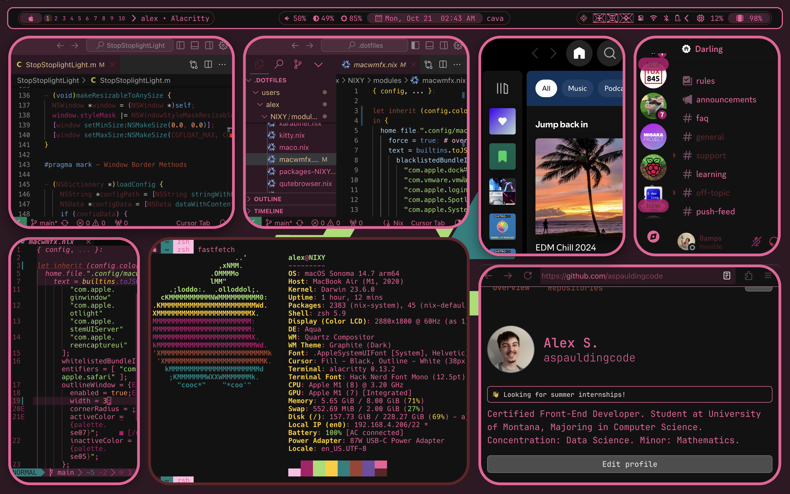

# macwmfx

# Information:
- macwmfx is a MacForge (SIMBL) plugin that enables configurable WindowManager Effects to macOS, similar to what swayfx does for sway on linux.
- Authored by [aspauldingcode](https://github.com/aspauldingcode)
- Inspired by [INTrafficLightsDisabler](https://github.com/indragiek/INTrafficLightsDisabler) and [StopStoplightLight](https://github.com/shishkabibal/StopStoplightLight)

# Features:
- Configurable windowfx dotfile in ~/.config/macwmfx/config
- Disable Titlebars
- Disable Traffic Lights
- Disable Window Shadows
- Disable Window Resize Constraints (resize almost all windows to any size)
- Enable Window Blur (configure blur radius and passes)
- Enable Window Transparency
- Border Outline (active/inactive), Border Width
- **Border Corner Radius** - This one is special.
- Whitelist applications by bundle identifier
- Blacklist applications by bundle identifier

# Installation:
1. Download [MacForge Apple silicon beta](https://github.com/jslegendre/appcast/raw/master/Beta/MacForge/MacForge.1.2.2-3.zip)
2. Download [macwmfx](https://github.com/aspauldingcode/macwmfx/releases/latest)
3. Unzip both downloads
4. Open `macwmfx.bundle` with `MacForge.app`
5. Restart computer

### Appeal:
Repurpose the code any way you like, but please don't just repackage it with your name. Remember to be nice to other people. If you make any changes and want to contribute, feel free to make a pull request.
