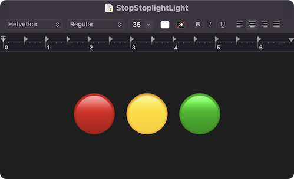

# macwmfx



## Information

macwmfx is a macOS tweak for ammonia injector that enables configurable WindowManager Effects to macOS, similar to what swayfx does for sway on linux.

- **Author**: [aspauldingcode](https://github.com/aspauldingcode)
- **Status**: Work in progress - actively being refactored
- **Inspired by**:
  - [INTrafficLightsDisabler](https://github.com/indragiek/INTrafficLightsDisabler)
  - [StopStoplightLight](https://github.com/shishkabibal/StopStoplightLight)
  - [AfloatX](https://github.com/jslegendre/AfloatX)
  - [Goodbye](https://github.com/MacEnhance/Goodbye)
  - yabai

## NOTICE: this is work-in-progress. I'm working on refactoring, and I promise this product will be complete at some point. macOS users will finally have some configurable window management ricing features. For now, please sit tight. Feel free to contribute if you'd like, although prs may not be merged, until I find a repo layout I'm happy with

## Features

- Configurable window effects via JSON configuration
- Window border customization (width, corner radius, colors)
- Window transparency and blur effects
- Titlebar modifications and traffic light customization
- Window shadow control
- Resize constraint removal
- Dock and menubar tweaks
- Application whitelist/blacklist support
- **Background server architecture** for reliable app management
- **One-command app reloading** with `macwmfx --reload`

## Architecture

macwmfx uses a **client-server architecture** for reliable operation:

- **Background Server** (`libmacwmfx_server.dylib`): Runs as an ammonia tweak, handles all window management operations and app lifecycle management
- **Client CLI Tool** (`macwmfx`): Communicates with the server via XPC messaging
- **Main Tweak** (`libmacwmfx.dylib`): Injected into applications to apply window effects

This architecture ensures that:

- The server can kill and restart all applications without being terminated itself
- Commands are processed reliably through XPC communication
- Configuration changes can be applied system-wide

## Installation

1. Download and install [ammonia](https://github.com/CoreBedtime/ammonia/releases/latest) from bedtime
2. Disable SIP, library validation, and enable preview arm64e abi
3. Clone and build:

   ```bash
   git clone https://github.com/aspauldingcode/macwmfx && cd macwmfx
   make help
   ```

> **Note:** In the future, `macwmfx` will be packaged for [Nixpkgs](https://nixos.org/) and [Homebrew](https://brew.sh/).
> This will allow installation with:
>
> - `nix profile install github:aspauldingcode/macwmfx` (or via flakes)
> - `brew install macwmfx`
>
> Stay tuned for official package availability!

## Configuration Setup

macwmfx uses a JSON configuration file. To get started:

1. **Create default configuration:**

   ```bash
   ./build/macwmfx --generate-config
   ```

   This will automatically:
   - Create the user config directory: `~/.config/macwmfx/`
   - Create the system config directory: `/Library/Application Support/macwmfx/` (with elevated privileges if needed)
   - Generate a default configuration at `~/.config/macwmfx/config.json`
   - Create a symlink from the system location to your user config
   - Handle all permission requirements seamlessly

2. **Edit your configuration:**

   ```bash
   # Edit the user config (recommended)
   nano ~/.config/macwmfx/config.json

   # Or edit the system config (same file due to symlink)
   sudo nano "/Library/Application Support/macwmfx/config.json"
   ```

3. **Apply changes:**

   ```bash
   # Restart all open apps to apply changes
   macwmfx --reload
   ```

## Building

### Using Makefile

```bash
# Show all available build commands and options
make help
```

The build system supports multiple configurations and targets. Run `make help` to see all available commands and their descriptions.

## CLI Tool Usage

The macwmfx CLI tool provides several useful commands and handles all permission requirements automatically:

```bash
# Show all available commands
./build/macwmfx

# Create default configuration (handles sudo automatically)
./build/macwmfx --generate-config

# Restart all open apps (kills them and restarts)
./build/macwmfx --reload

# Server management
./build/macwmfx --start              # Start the background server
./build/macwmfx --stop               # Stop the background server
./build/macwmfx --status             # Show server status

# Observe macwmfx logs
./build/macwmfx --observe-logs

# Runtime configuration changes
./build/macwmfx enable-borders
./build/macwmfx disable-borders
./build/macwmfx set-border-width 3.0
./build/macwmfx set-border-radius 10.0
./build/macwmfx enable-resize
./build/macwmfx disable-resize
```

**Note:** The CLI tool automatically requests elevated privileges when needed (e.g., for system-level configuration). No manual `sudo` commands are required.

## Key Features

### `macwmfx --reload` Command

The `macwmfx --reload` command is a powerful feature that:

1. **Kills all open applications** (except system processes)
2. **Reloads the configuration** from disk
3. **Restarts applications** with the new configuration applied

This ensures that configuration changes take effect immediately across all applications. The background server architecture allows this to work reliably without the command being terminated mid-process.

### Background Server

The background server (`libmacwmfx_server.dylib`) runs as an ammonia tweak and:

- Handles all window management operations
- Manages application lifecycle
- Processes commands via XPC messaging
- Remains active even when applications are killed/restarted

### XPC Communication

All commands are sent to the server via XPC messaging, ensuring:

- Reliable communication between client and server
- Proper error handling and response codes
- Asynchronous command processing
- System-level integration

## Development

For detailed development information, architecture overview, and contribution guidelines, see [Dev_Guide.md](Dev_Guide.md).

## Contributing

Feel free to contribute! However, please note that this project is actively being refactored, so PRs may not be merged until the new architecture is finalized. Please provide appropriate attribution rather than simply rebranding the code.

## License

This project is open source. Please be respectful of the open source community and provide appropriate attribution for any adaptations.
